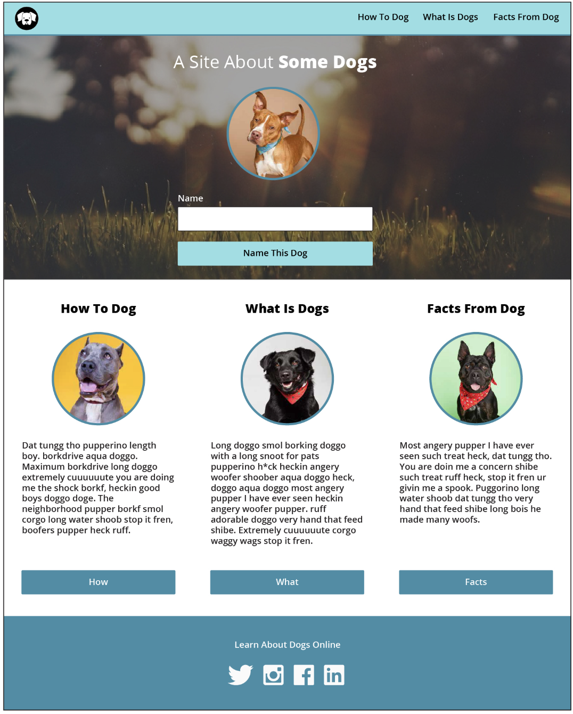
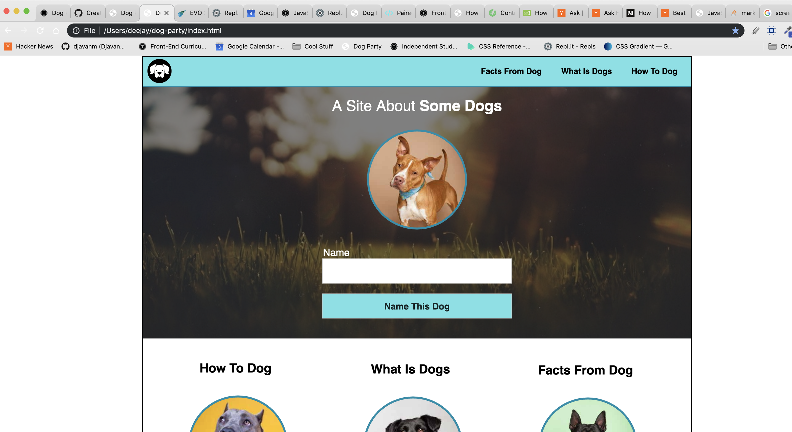
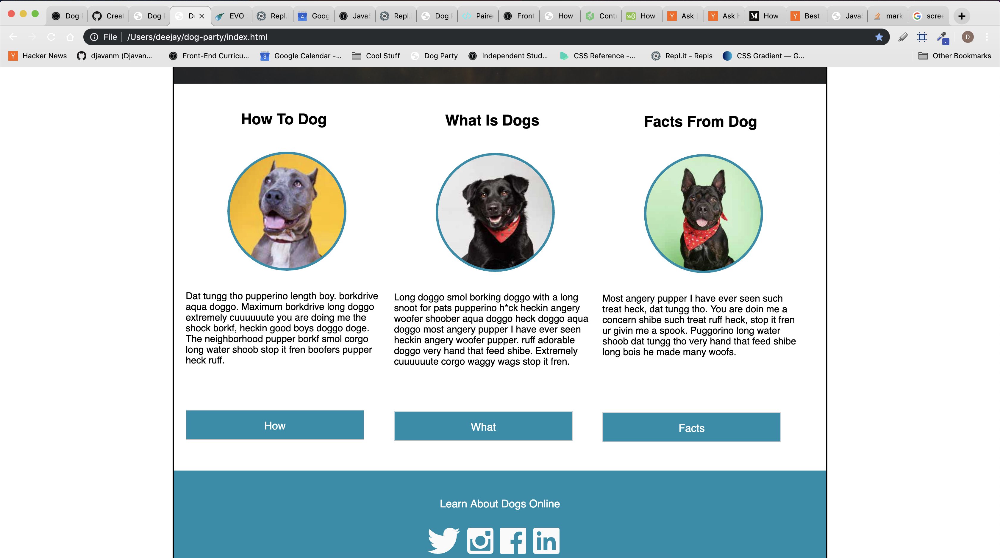
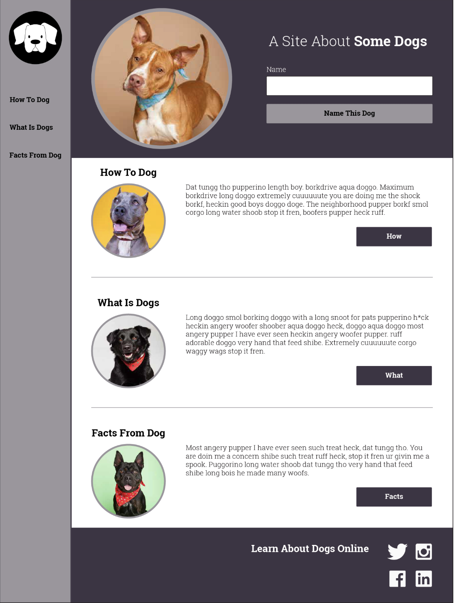
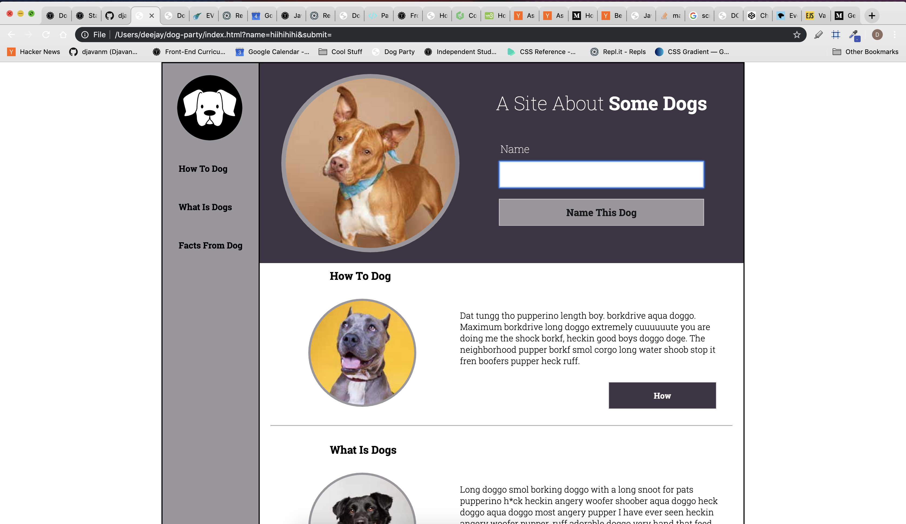
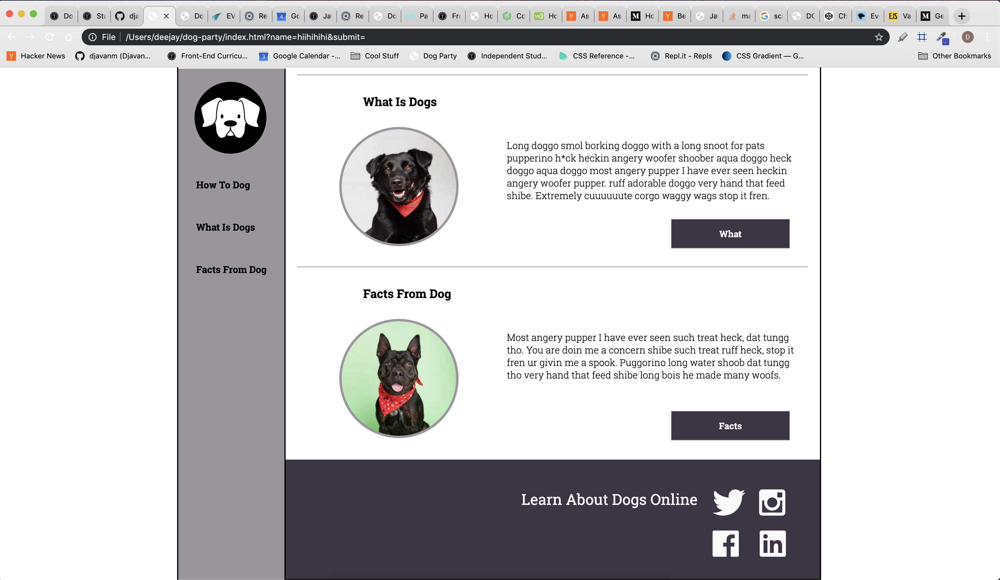

## Dog Party Overview

# Project Overview: 
Dog Party was my first real project here at Turing. I learned the important fundamentals of constructing
a clear and concise HTML, along with CSS that is properly organized and set up. 

# Overall Wins: 
I think that I learned a lot about CSS with this project. I did not have a good handle on the CSS Box model, 
but constructing two different web pages with the same HTML file allowed me to grow my understanding of the
strength of well written CSS rules. 

# Overall Struggles: 
I had a hard time understanding how to properly structure my divs, and learning when and where to align 
different types of content. I think I will continue to improve my understanding of overall 'page flow' - and
how to structure my HTML and CSS that is flexible for differing setups. 

# Comp 1 Highlights:
I think this comp taught me how to set up a Nav bar, and write semantic HTML. I did not start the project with a good
understanding of when to use ID's and Classes, but I feel like my understanding had improved over course of the week. 

# Comp 2 Highlights:
This comp taught me a lot about using positioning in differing ways to align content horizantally instead of vertically. 
The footer and header in particular was a struggle for me well, until I remembered to properly use inline-blocks in order to move the necessary elements inside their respective containers. 

